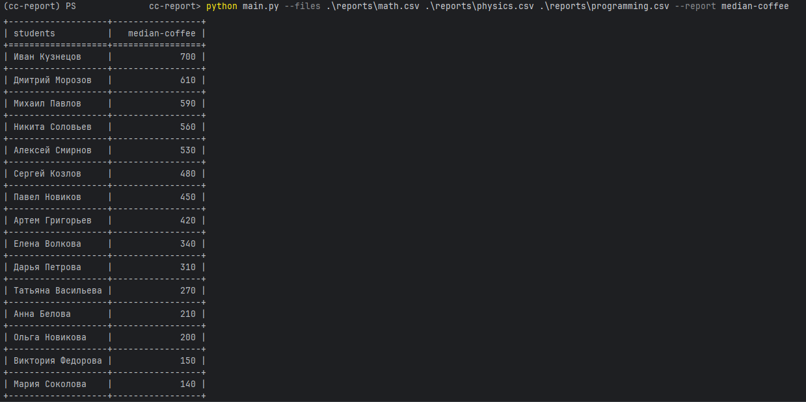

# cc-report

Скрипт для генерации отчетов из CSV файлов (по умолчанию рассчитывает медианные траты студентов на кофе).

> Данный проект был выполнен в качестве тестового задания.

## Пример использования

Необходимо передать пути к одному или нескольким CSV-файлам через `--files`. 

```bash
python main.py --files data1.csv data2.csv
```

Для явного указания типа отчета (median-coffee используется по умолчанию) использовать `--report`:
```bash
python main.py --files students_data.csv --report median-coffee
```

### Пример вывода


## Тесты

Тестами покрыты три основных компонента:
1. Парсинг аргументов (`test_cli.py`): Проверяет правильность чтения флагов --files и --report, 
включая установку значений по умолчанию.
2. Чтение файлов (`test_parser.py`): Проверяет корректное объединение строк из нескольких CSV-файлов 
в единый массив данных и отлавливает ошибки, если в колонке coffee_spent переданы нечисловые значения.
3. Логика отчетов (`test_reports.py`): Тестирует математику вычисления медианы, 
правильную сортировку результатов (по убыванию трат), а также передачу пустого списка 
или файлов без нужных колонок (`student`, `coffee_spent`).

---

## Лицензия

Проект распространяется по лицензии [MIT](LICENSE).
